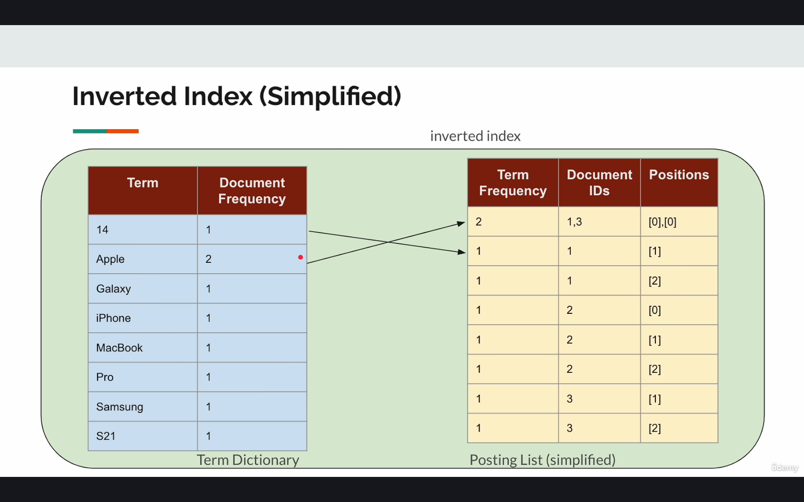
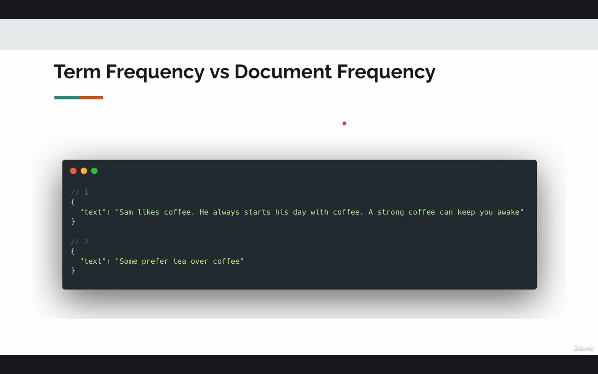
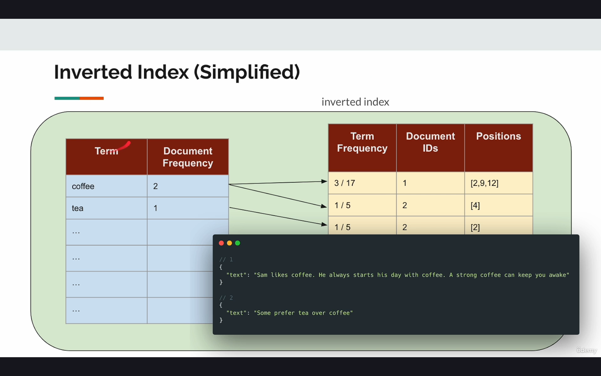

## Term Dictionary
***

```
Term Dictionary is a component of Inverted index and both are used interchangibly.
Inverted index table is composed of Term Dictionary and Posting List tables
```

***

```
Term Frequency Vs Document Frequency
 - Document Frequency : Provides the number of unique time the word appears in an entries.
                        Eg : Coffee appears atleast once in both the entries , hence coffee=2
                        
 - Term Frequency : Provides the number of times the words appears in the entry out of the total number of words.
                    Eg: Coffee appears 3 times in first entry of "text" out of total length of 17 , hence 3/17
                    
 These terms are used in calculation of relevant scores.
```


***


