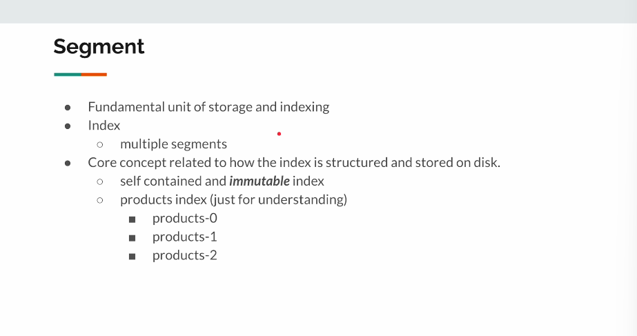
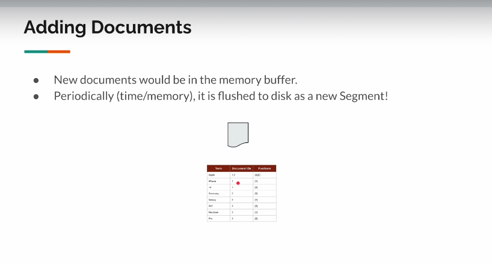
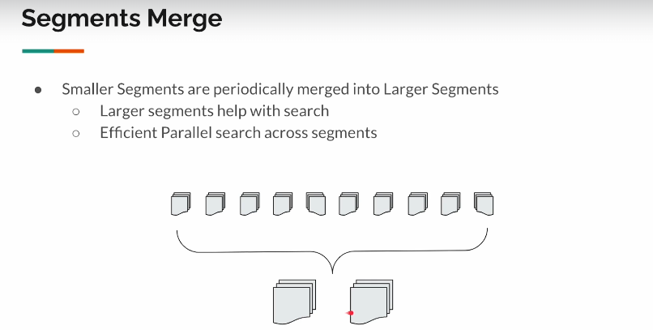
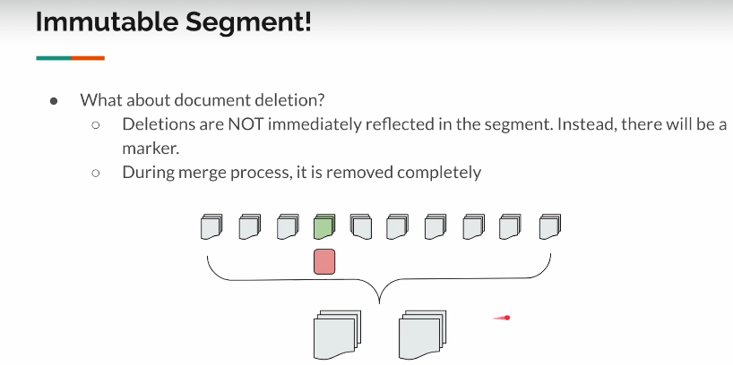
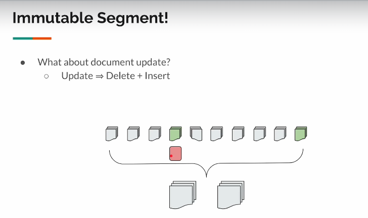

## Segments
> Lucene self contained mini index
> Fundamental unit of storage and indexing
> Optimised for Faster write and search


***

```
Segments are fundamental unit of storage and indexing in Apache lucene.
When we store something(let's assume products), it splits it into multiple segments,
and each and every index is a self contained immutable index.

When we create a products index, there would be multiple segments created for this
and each of these will act as a mini index.

    products index
     - products-0
     - products-1
     - products-2
```



***

## Adding a Documents
> New Documents would be in a memory buffer .
> Periodically(time/memory), it is flushed to disk as a new segment and then to Inverted index table

> Eventually we would have multiple segments.
> Pros : Super fast writes .
> Cons : Search might be slow as we have to search across multiple segments to
retrieve the results(solved by **Segments Merge**).

***
## Segments Merge

```
Periodically Lucene merges smaller segments into a larger one which eventually helps in search.
```


***

## Immutable Segment
> Deletion are not immediately reflected in Segment, instead a *marker* is created to mark 
> the deletion of an entry.

> Analogy : 
  - Assume a product-10 is created with POST /_products/_doc/10 which contains product of *Apple Iphone 14*.
  - DELETE /_products/_doc/10 is run to delete the entry of product-10. 
  - To mark deletion a **Marker** is created to mark the deleted product. 
  - Now when a *Search for Apple* is made the result would initially contain the result from product-10 as well , however the entry in marker would remove it from the search result and return the response back. 
  - This entry eventually get's deleted from the Segments when merge operation is done.

 
> Document Update =  Delete + Insert
> Follows the same method of delete to first delete the product and then inserts a new one

