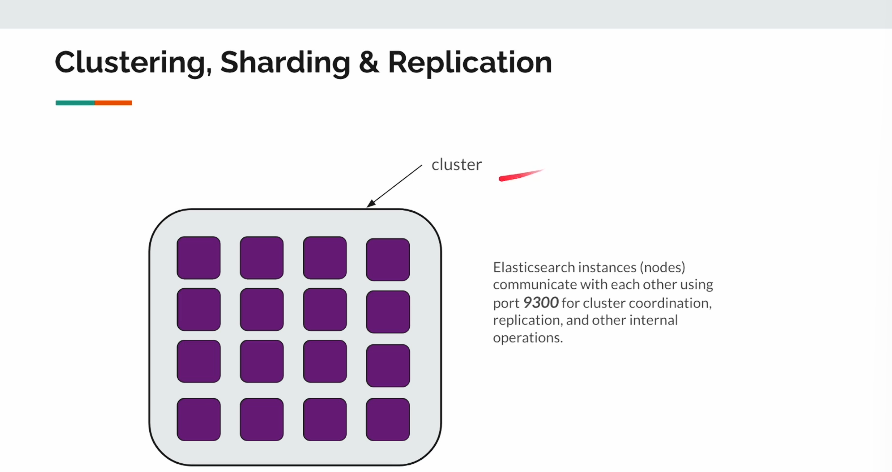
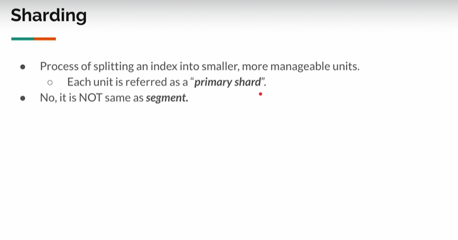
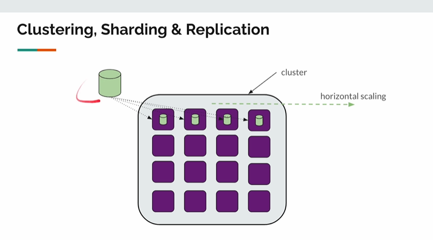
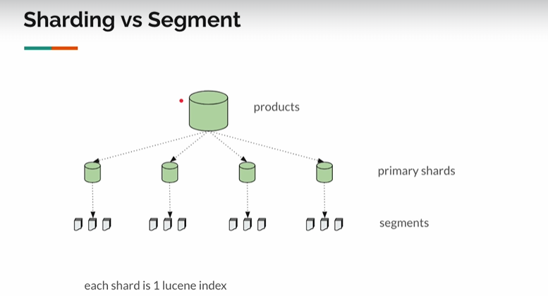
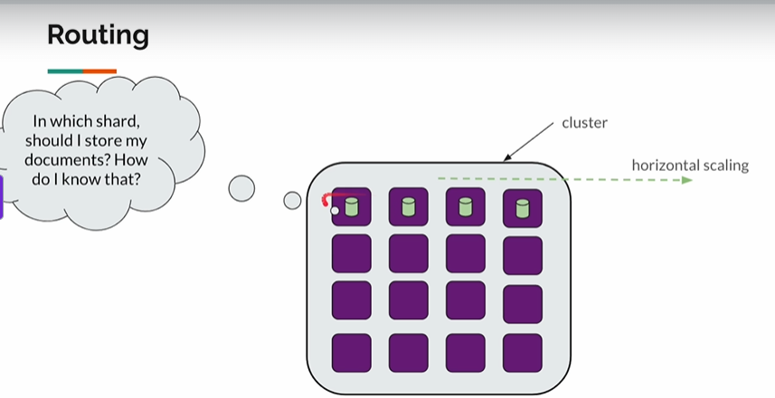
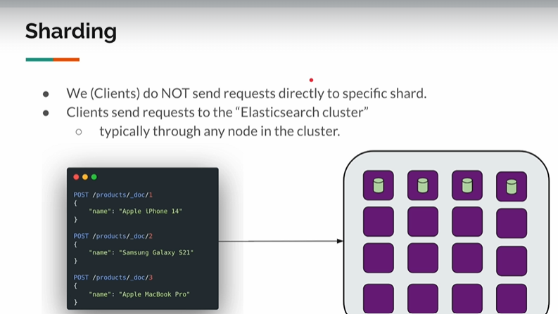
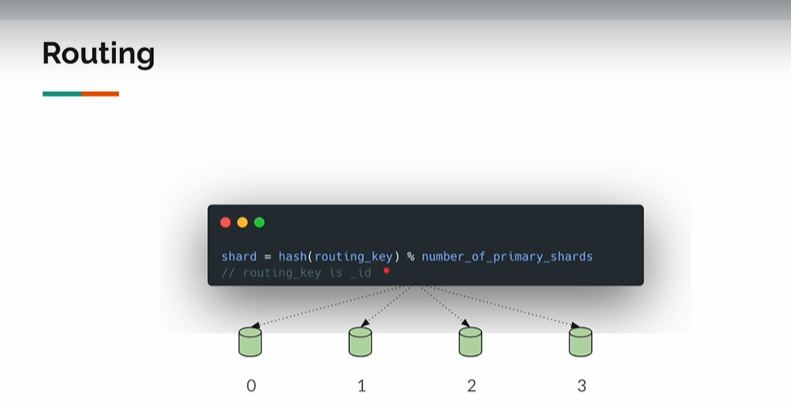
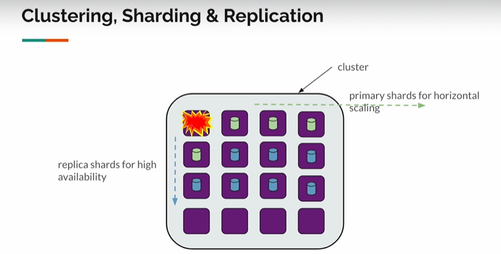
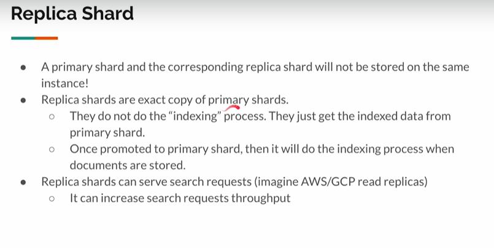

## Clustering, Sharing and Replication

> Elasticsearch - highly available and horizontally scalable. 
> Use docker compose for learning , but **Managed Services** in Production.

***

## Distribution of data across multiple nodes
> In Elasticsearch it is very easy to setup a cluster, we can run multiple
> machines or nodes with elasticsearch as shown in the image below(violet boxes).
> Every box in the image represents a elastic search instance connected to each other
> via a network. Once these nodes understands that they are a part of a cluster
> then they would take to each other using port 9300.
> NOTE : Port 9300 - is used for cluster co-ordination, replication and other internal operations


***
## Clusters
``` 
A cluster is a collection of one or more nodes that together:
- Store data across all nodes

- Distribute indexing and search workloads

- Ensure high availability and fault tolerance

- Each cluster is identified by a unique name, which must be the same on all nodes that belong to it.
```
***
## Sharding


> Each and every primary shards are a part of elasticsearch instance, hence every shard is part of lucene index.
> Lucene behind the scene would create segments for each of the primary shards.
> **NOTE** : Splitting index into shards is done by Elasticsearch for scaling purposes , shard to segments is done by lucene for first read and write.


***
## Routing
```
In which shard should we store the document?
 - It is not determined by the request
```




> Analogy for storing: 
  - When we want to store a document with id = 1, shard would be calculated using the formula hash(routing_key) % number_of_primary_shards(here 4)
  - shard = hash(1) % 4 = 41 % 4 = 1 (Assuming hash(1) = 41)
  - The product would get stored in 1 shard


> Analogy for searching :
  - With id , the same methodology is used
    - Calculate shard = hash(1) % 4 = 41 % 4 = 1 (Assuming hash(1) = 41)
    - Fetch the product from shard = 1
  - Without id, let's assume we search for 'Apple iphone 14'
    - For fetching the documents without id , the **Scatter Gather** pattern would be used where request would be sent to each of the shards.
    - Response aggregated and returned
***
## Replication
```
Primary shards for scaling.
Replica shards for high availability.

Useful when a node goes down , and helps use avoid SPOF. A primary node could have any
number of replica nodes which gets the indexed data from the primary shard. 
Once the primary node gets down , one of them would be promoted to primary shard, then 
it will do the indexing process when documents are stored.
```



> **NOTE**: The following wouldn't be a case always. Multiple primary shards could be placed on the same instance if there's only one node.
> 


