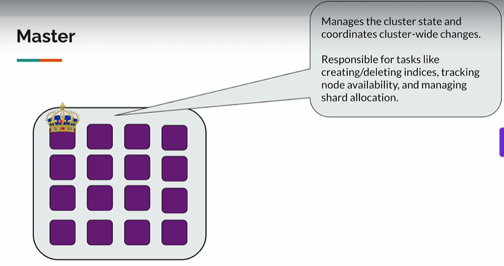
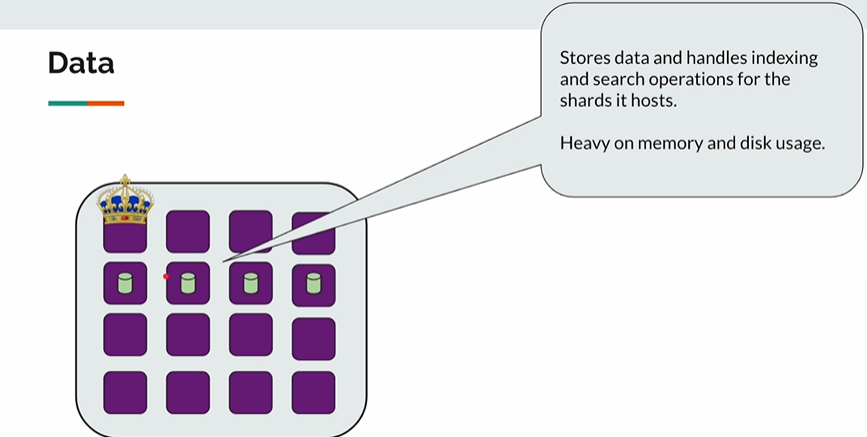
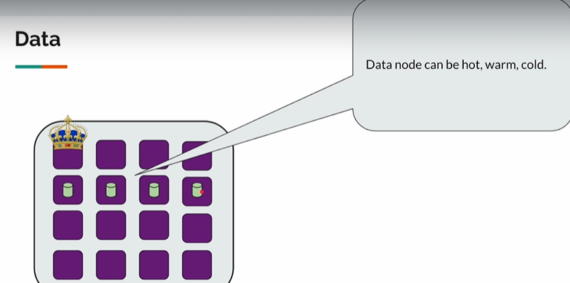
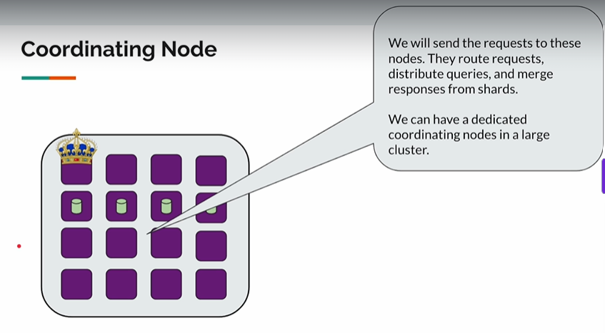
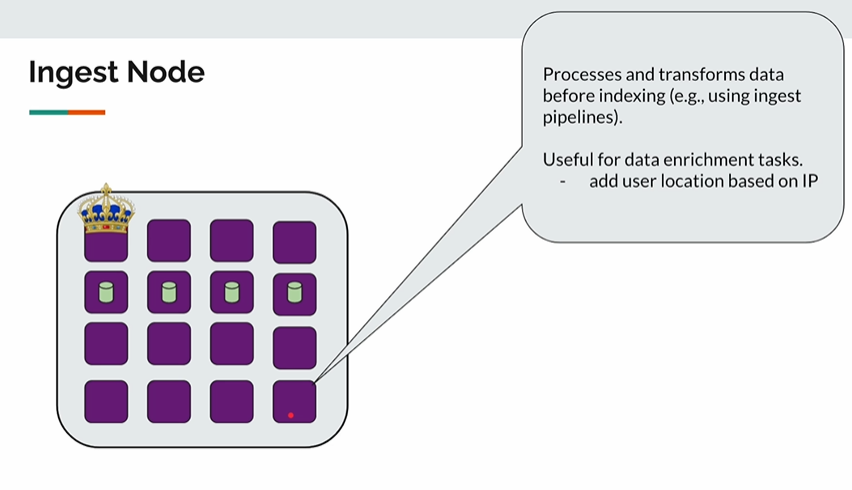

## Node Roles
```
A cluster could have multiple nodes and we want the cluster to perform multiple operations for us.
Like creating an index, scaling, providing high availability, storing documents and handling search request etc.
To ensure high availability the cluster has to check the node health and create replica of nodes.
Hence each node in cluster could be assigned to perform specific roles.
```
- Master
  - Manages the cluster and co-ordinates cluster-wide changes.
  - Responsible for creating/deleting indices, tracking node availability and managing shard allocation.
    
  - When master goes down, election process gets conducted to select a master node through vote.

- Data
  - Stores data, handles indexing and search operations for the shards it hosts
  - Heavy on memory and disk usage.
    
  - Could be hot(frequently used data), warm(less frequently used than hot) ,cold(least frequently used)
    
  
- Co-ordinating Node
  - Send the requests to these nodes
  - Responsible for route requests, distribute queries and merge responses from shards.
  - By default any node could be a co-ordinating node, however we can have dedicated co-ordinating nodes in a large cluster
  

- Ingest Node
  - 