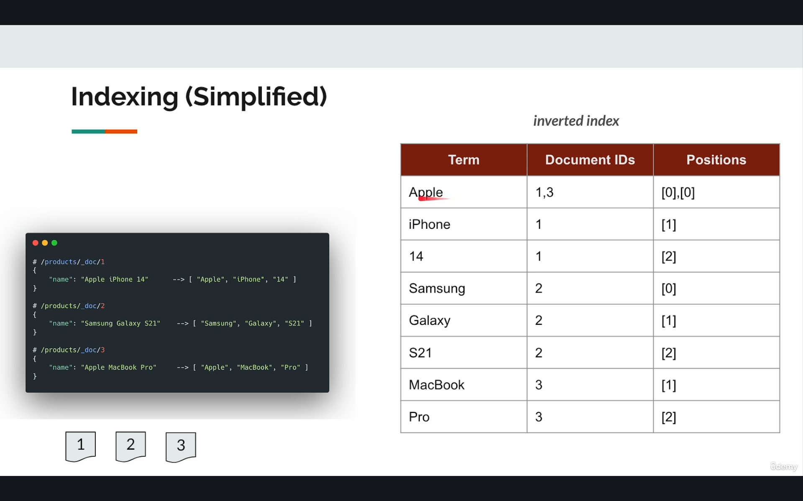
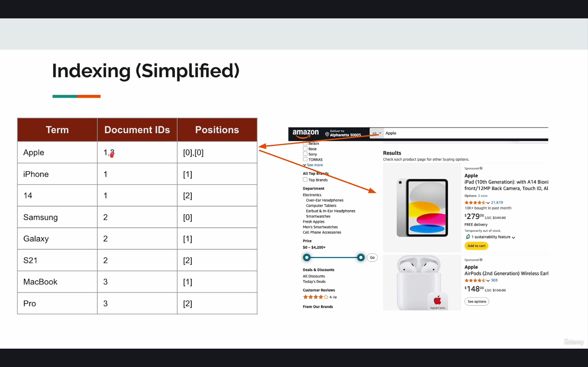
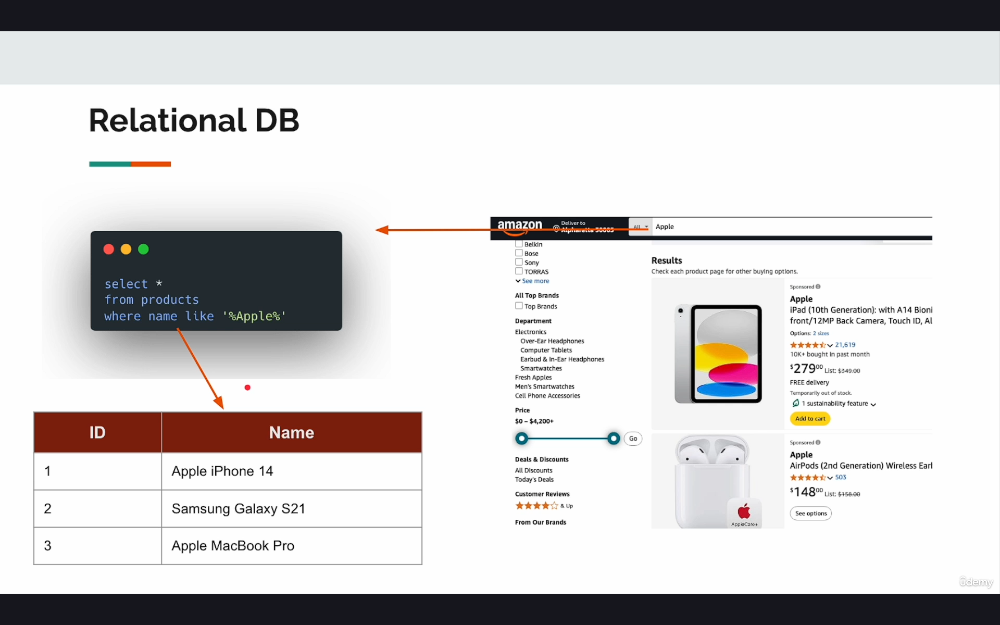
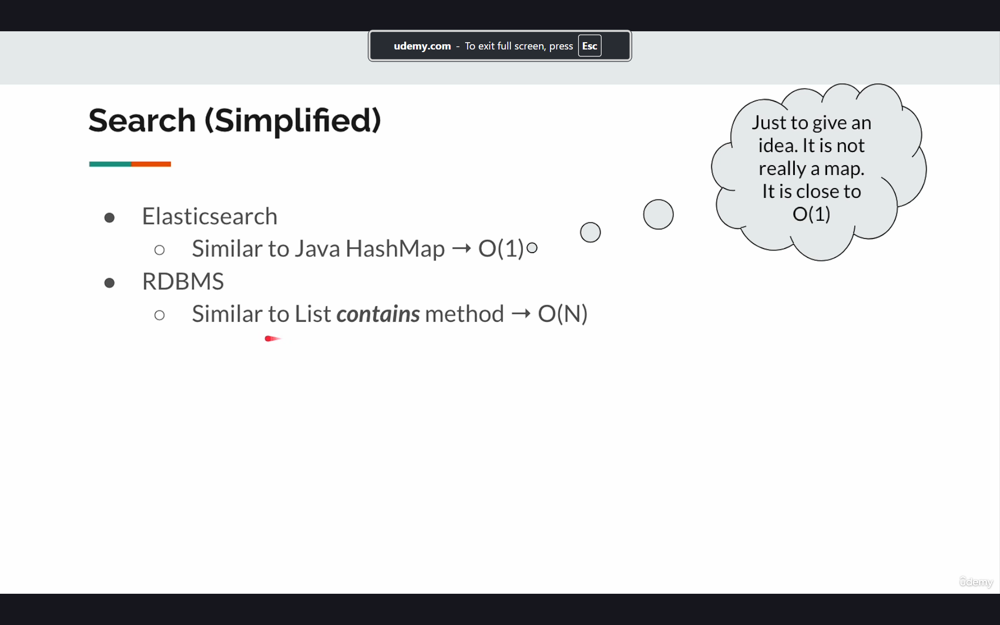
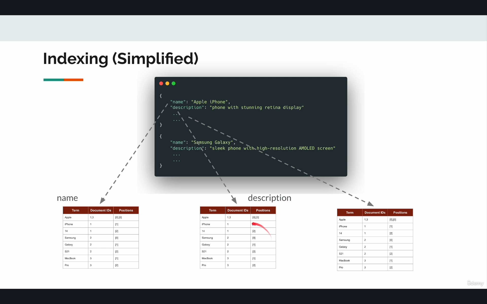
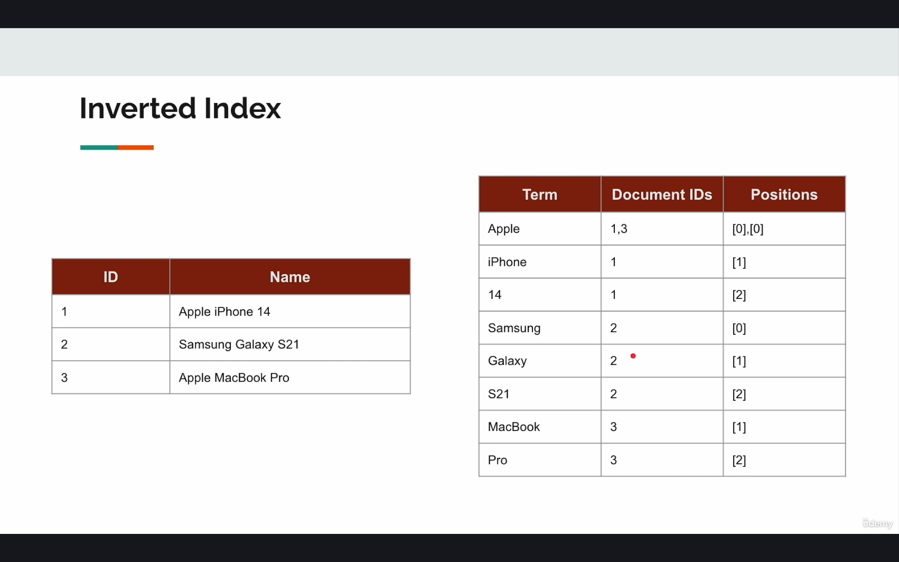

## Elastic Search under the hood

```
Elastic search uses Apache lucene behind the scenes
 - Apache lucene is a Java library which handles 
    i) actual storage
    ii) indexing documents
    iii) search
 
 NOTE : Apache lucene is a library and not a server. Designed to be embedded into an application and Does not expose Web APIs.
        Elasticsearch is a distributed REST based server on top of lucene!
```


```
Let's assume Amazon has an index of products

 # /products/_doc/1
 {
    "name" : "Apple iphone 14"
 }
 
  # /products/_doc/2
 {
    "name" : "Samsung Galaxy S23"
 }
 
  # /products/_doc/3
 {
    "name" : "Apple Macbook Pro"
 }
 
Apache lucene parses the document as tokens(known as tokenisation or rather **Analysis** into 
     
     ["Apple" , "iPhone" , "14"]
         
     ["Samsung" , "Galaxy" , "S23"]  
     
     ["Apple" , "Macbook" , "Pro"]  

and maintains a table called ***Inverted Index*** (table shown below)

PS : Tokenisation is just one part of analysis process
```



``` 
Now if someone searches for Apple , and the request is received by a search engine.

Search engine will look for the term of Apple in Inverted index table and would return
product 1,3 as shown below
```




```
Comparison with RelationalDB - query below would check for Apple in every row , hence leading to performance dip
```




```
Indexing Simplifed - for each and every field we would have an inverted index table created
```


```
Q) Why is this table called Inverted index? 
 - It's because we invert the index. In traditional database, consider the one 
    attached below we treat the ID as the index and search operations are 
    performed on the basis of that for faster results. However in case of Elasticsearch the search
    operations are performed on the basis of Term which is exactly the opposite of relationalDb
    , hence the name of Inverted Index.
```



